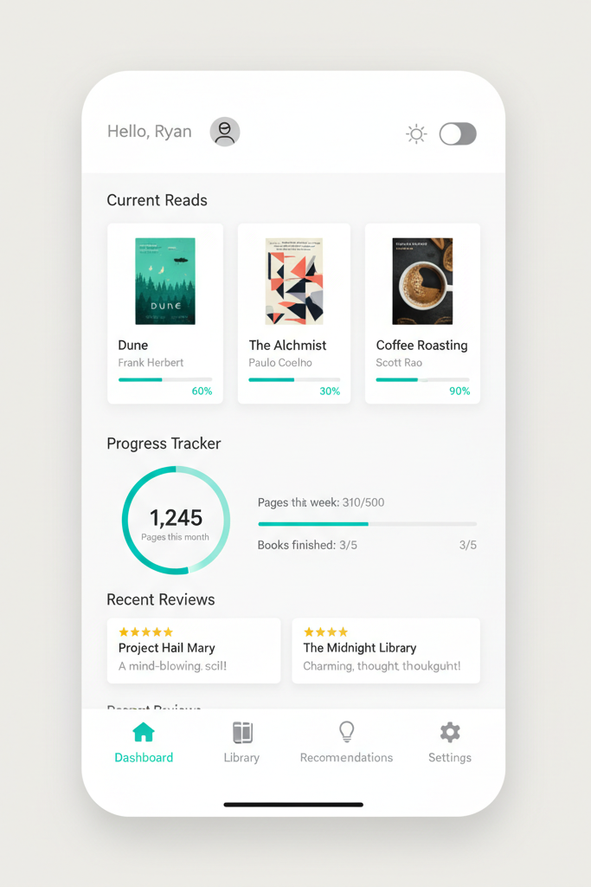
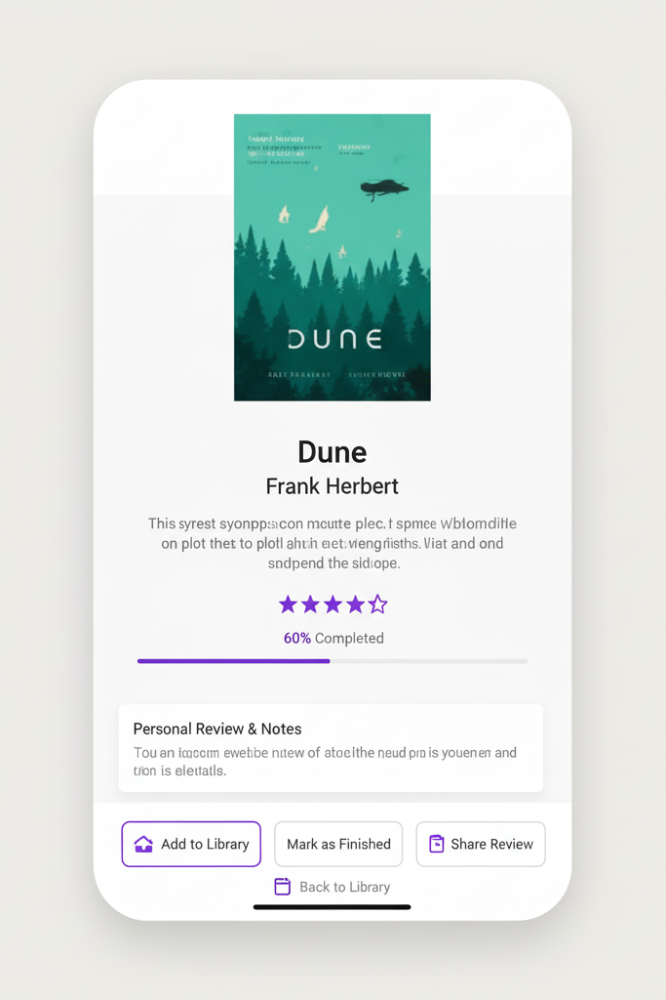
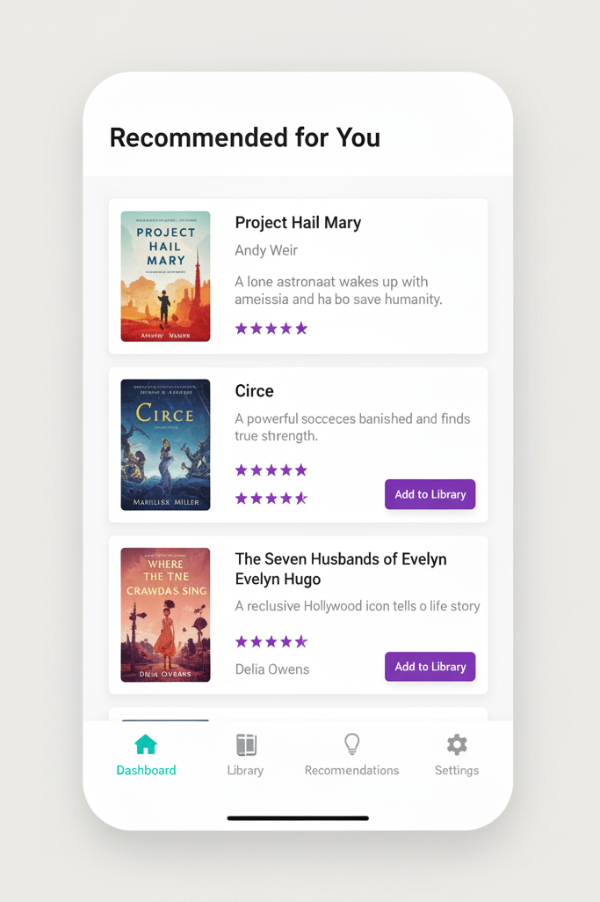

# Boook_and_Reading_Tracker
An Android application designed to help avid readers, book club members, students &amp; researchers organize their reading journey — from logging books and tracking progress to writing reviews and discovering personalized recommendations.

## Overview

This project is developed for **CP3406** as part of **Assignment 1 Part B: Code Review Presentation**.  
The app provides a clean and intuitive experience for managing every stage of a reader’s journey, combining book tracking, reviewing, and intelligent discovery in one platform.

## Features

- **Book Logging** – Add books manually, via search, or by scanning ISBN codes.  
- **Progress Tracking** – Log pages read per session and view completion statistics.  
- **Ratings & Reviews** – Write personal reflections and rate books after finishing.  
- **Reading Goals & Reminders** – Set daily or weekly goals with push notifications.  
- **Personalized Recommendations** – Get book suggestions based on your reading history and preferences.  
- **Dark/Light Mode** – Switch between themes for a comfortable reading experience.  
- **Custom Shelves & Tags** – Organize your library using custom categories.  

## Tech Stack

- **Language:** Kotlin  
- **Framework:** Jetpack Compose (Material 3 Design)  
- **Architecture:** MVVM (Model-View-ViewModel)  
- **Database:** Room / Firebase (TBD)  
- **API:** Google Books API or Open Library API  
- **Version Control:** Git + GitHub  

## UI Previews

Below are the latest mockup screens:

### Dashboard Screen

### Book Details & Review Screen

### Recommendations Screen

*(All designs are minimalistic and follow the app’s proposed color palette and layout from the project proposal.)*

## Development Timeline

| Phase | Duration | Description |
|-------|-----------|-------------|
| Planning & Research | Week 1–2 | Define scope, create wireframes |
| UI/UX Design | Week 3–4 | Build mockups using Jetpack Compose |
| Core Features | Week 5–7 | Implement logging, tracking, and reviews |
| Advanced Features | Week 8–9 | Add recommendation engine & reminders |
| Testing | Week 10–11 | Debug, optimize UI, fix issues |
| Finalization | Week 12 | Documentation & submission |

## Version Control Workflow

- Create feature-specific branches  
- Commit frequently with clear messages  
- Submit pull requests for review  
- Merge approved changes into `main`  
- Tag releases for major milestones  

